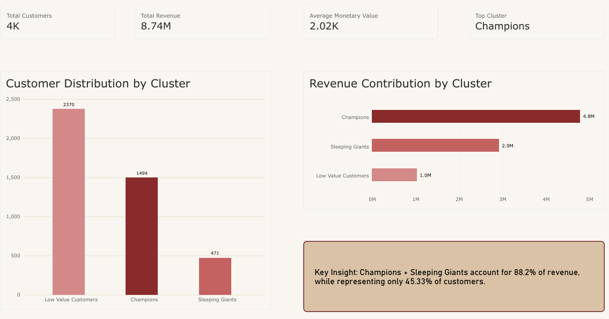
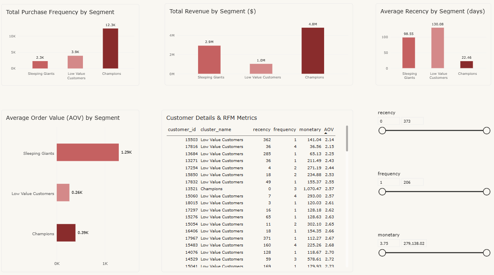
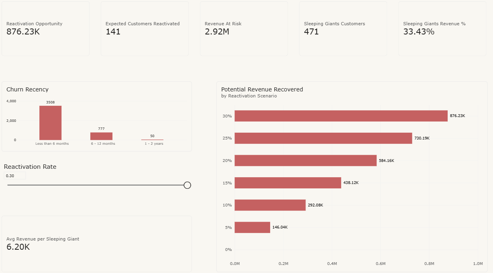

# Customer Segmentation & RFM Analysis

An end-to-end customer analytics project using **RFM analysis**, **K-Means clustering**, and **Power BI** to identify high-value customers, detect potential inactivity, and quantify revenue recovery opportunities.

The project transforms transactional data into **actionable customer segments and business strategies** for retention, reactivation, and customer development.

---

## 📊 Interactive Power BI Dashboard

> **[View Interactive Power BI Dashboard](https://app.powerbi.com/groups/me/reports/1903de57-2a22-4e42-b404-9c8d6901411a?ctid=0e0cb060-09ad-49f5-a005-68b9b49aa1f6&pbi_source=linkShare)**

The Power BI dashboard translates the analytical results into an interactive business decision-support tool, allowing users to explore customer value, behavioral segments, strategic priorities, and potential revenue recovery.

### Executive Overview

The Executive Overview provides a high-level view of customer distribution, revenue concentration, and the overall business opportunity.



---

### Customer Segmentation

The Customer Segmentation dashboard allows users to explore customer behavior across the identified segments and understand the characteristics and value of each group.



---

### Financial Impact

The Financial Impact dashboard translates customer segmentation into potential revenue recovery scenarios by allowing users to evaluate different reactivation rates for Sleeping Giants.



---

## 1. Business Problem

The company has a large customer base but lacks a clear understanding of customer value and purchasing behavior.

Without effective segmentation, marketing resources may be allocated uniformly, making it difficult to:

* Prioritize high-value customers.
* Identify customers with declining engagement.
* Detect customers with high historical value but lower recent activity.
* Allocate retention and reactivation efforts efficiently.
* Quantify the potential financial impact of customer reactivation.

### Main Question

> **How can we segment customers based on their purchasing behavior to identify high-value and potentially inactive customers, and what strategies can be implemented to improve retention and revenue?**

### Business Objectives

* Identify high-value and highly engaged customers.
* Identify customers with high historical value but lower recent activity.
* Understand revenue concentration across customer segments.
* Develop targeted strategies for each segment.
* Estimate the potential financial impact of customer reactivation.

---

## 2. Dataset

The analysis uses the **Online Retail II** dataset, containing transaction records from a UK-based online retailer between **December 2009 and December 2011**.

### Key Attributes

* Customer ID
* Invoice
* Invoice Date
* Stock Code
* Description
* Quantity
* Unit Price
* Country

### Data Source

[Online Retail II Dataset — Kaggle](https://www.kaggle.com/datasets/tunguz/online-retail-ii/data)

---

## 3. Analytical Workflow

The project follows an end-to-end analytical workflow:

```
Raw Data
    ↓
Data Cleaning
    ↓
Exploratory Data Analysis
    ↓
RFM Analysis
    ↓
Feature Engineering
    ↓
K-Means Clustering
    ↓
Customer Segmentation
    ↓
Business Analysis
    ↓
Financial Impact Analysis
    ↓
Power BI Dashboard
```

---

## 4. Data Preparation

Before performing customer segmentation, the transactional dataset was cleaned and prepared for analysis.

The preprocessing workflow included:

* Handling missing customer identifiers.
* Removing invalid transactions.
* Filtering transactions with non-positive quantities or prices.
* Converting transaction dates into the appropriate datetime format.
* Creating transaction-level revenue.
* Aggregating transactional data at the customer level.

The resulting customer-level dataset was then used for RFM analysis and clustering.

---

## 5. Exploratory Data Analysis

Exploratory Data Analysis was performed to understand the structure of the transactional dataset and identify relevant purchasing patterns.

The analysis examined:

* Transaction volume.
* Revenue distribution.
* Customer purchasing behavior.
* Product prices and quantities.
* Transaction frequency.
* Revenue concentration.
* Potential outliers.
* Customer-level purchasing patterns.

The EDA provided the foundation for selecting and engineering features for customer segmentation.

---

## 6. RFM Analysis

Customer behavior was summarized using the three core RFM dimensions.

### Recency

Measures how recently a customer made a purchase.

```
Recency = Reference Date - Last Purchase Date
```

Lower values indicate more recent activity.

### Frequency

Measures how frequently a customer purchases.

```
Frequency = Number of Unique Purchases
```

Higher values indicate stronger purchasing engagement.

### Monetary

Measures the total historical revenue generated by a customer.

```
Monetary = Total Customer Revenue
```

Higher values indicate greater customer value.

RFM analysis provided a behavioral representation of each customer that could subsequently be used for segmentation.

---

## 7. Customer Segmentation

K-Means clustering was applied to customer-level behavioral features.

The clustering process used:

* Recency
* Frequency
* Monetary
* Average Order Value
* Average Quantity
* Discount Rate

Feature preparation included transformation and scaling to reduce the influence of skewed variables and differences in magnitude.

### Selecting the Number of Clusters

The number of clusters was evaluated using:

* **Elbow Method**
* **Silhouette Score**

The final configuration selected **K = 3**, providing a meaningful balance between cluster separation and business interpretability.

The resulting clusters were then analyzed based on their behavioral characteristics and translated into business-oriented customer segments.

---

## 8. Customer Segments

The final customer-level analysis identified **4,335 customers** across three actionable segments.

| Segment             | Customers | % of Customers | % of Revenue |
| ------------------- | --------: | -------------: | -----------: |
| Low Value Customers |     2,370 |          54.7% |        11.8% |
| Champions           |     1,494 |          34.5% |        54.8% |
| Sleeping Giants     |       471 |          10.9% |        33.4% |

### 🏆 Champions

**1,494 customers · 34.5% of customers · 54.8% of revenue**

Champions represent highly engaged customers with strong purchasing activity and significant contribution to total revenue.

**Business Objective:** Protect and retain.

#### Recommended Strategies

* Loyalty rewards.
* Exclusive benefits.
* Personalized recommendations.
* Premium customer experiences.
* Early access to new products.
* Retention campaigns.

The primary objective is to protect the company's most valuable active customer base and reduce potential revenue loss.

---

### 😴 Sleeping Giants

**471 customers · 10.9% of customers · 33.4% of revenue**

Sleeping Giants represent customers with significant historical monetary value but lower recent activity.

This makes them particularly relevant for **reactivation campaigns**.

**Business Objective:** Reactivate.

#### Recommended Strategies

* Personalized win-back campaigns.
* Product recommendations based on previous purchases.
* Targeted promotional offers.
* Time-limited incentives.
* Personalized email campaigns.
* High-value customer reactivation programs.

> Sleeping Giants represent **potential inactivity**, not confirmed customer churn.

The objective is to recover purchasing activity from customers who have previously demonstrated significant economic value.

---

### 📉 Low Value Customers

**2,370 customers · 54.7% of customers · 11.8% of revenue**

This segment represents the majority of customers but contributes a relatively small share of total revenue.

**Business Objective:** Develop efficiently.

#### Recommended Strategies

* Automated promotional campaigns.
* Cross-selling.
* Product recommendations.
* Increasing purchase frequency.
* Increasing average order value.
* Low-cost scalable campaigns.

The objective is to increase customer value while maintaining marketing efficiency.

---

## 9. Key Findings

### Revenue Concentration

Champions generate **54.8% of total revenue** while representing only **34.5% of customers**.

This makes customer retention a major business priority.

### Sleeping Giants Opportunity

Sleeping Giants represent only **10.9% of customers**, but contribute **33.4% of total revenue**.

Their combination of high historical value and lower recent activity makes them the primary reactivation opportunity.

### High-Value Customer Concentration

Champions and Sleeping Giants together represent:

* **45.4% of customers**
* **88.2% of total revenue**

This demonstrates a strong concentration of revenue among a relatively small portion of the customer base.

### Strategic Implication

Marketing resources should not be distributed uniformly across the customer base.

Instead, resources should be prioritized according to customer value and behavioral characteristics:

```
Champions
    ↓
Retention & Loyalty

Sleeping Giants
    ↓
Reactivation & Win-Back

Low Value Customers
    ↓
Efficient Customer Development
```

---

## 10. Business Recommendations

| Segment                 | Strategy            | Objective                                                |
| ----------------------- | ------------------- | -------------------------------------------------------- |
| **Champions**           | Protect & Retain    | Maintain loyalty and reduce customer loss                |
| **Sleeping Giants**     | Reactivate          | Recover potential revenue through targeted campaigns     |
| **Low Value Customers** | Develop Efficiently | Increase frequency and customer value at controlled cost |

### Strategic Prioritization

#### 1. Protect Champions

Champions represent the largest revenue contribution.

Retention strategies should focus on:

* Loyalty programs.
* Personalized experiences.
* Exclusive benefits.
* Premium offers.
* Personalized recommendations.

The objective is to prevent revenue loss from high-value customers.

---

#### 2. Reactivate Sleeping Giants

Sleeping Giants represent the most significant reactivation opportunity.

Recommended actions include:

* Personalized win-back campaigns.
* Recommendations based on previous purchases.
* Targeted incentives.
* Time-limited offers.
* Customer-specific messaging.

The objective is to convert historical customer value into renewed purchasing activity.

---

#### 3. Develop Low Value Customers Efficiently

Because this segment represents more than half of the customer base but only 11.8% of revenue, strategies should prioritize scalability and cost efficiency.

Recommended actions include:

* Automated campaigns.
* Cross-selling.
* Upselling.
* Product recommendations.
* Frequency-based promotions.

Under this scenario:

> **10% Reactivation → ~$292K Potential Revenue Recovery**

This represents a **potential revenue opportunity**, not guaranteed revenue.

The actual outcome would depend on:

* Campaign effectiveness.
* Customer response rates.
* Promotional costs.
* Product availability.
* Customer behavior.
* Marketing execution.

Therefore, the estimated opportunity should be validated through controlled marketing experiments such as A/B testing.

---

## 12. Power BI Dashboard

The Power BI dashboard was designed as an **interactive business decision-support tool**, translating the analytical results into actionable insights.

### Dashboard Sections

#### Executive Overview

Provides a high-level view of:

* Customer KPIs.
* Revenue KPIs.
* Customer distribution.
* Revenue contribution.
* Segment performance.

#### Customer Segmentation

Allows users to explore:

* RFM profiles.
* Segment characteristics.
* Customer behavior.
* Segment-level performance.
* Customer-level analysis.

#### Financial Impact

Provides:

* Reactivation scenarios.
* Potential revenue recovery.
* Interactive reactivation rate analysis.
* Financial impact of different scenarios.

---

## 13. Key Performance Indicators

The following KPIs can be used to evaluate the effectiveness of the proposed strategies.

### Retention

* Customer Retention Rate
* Repeat Purchase Rate
* Customer Purchase Frequency

### Reactivation

* Reactivation Rate
* Reactivated Customers
* Revenue Recovered

### Financial Performance

* Campaign Cost
* Revenue Recovered
* Marketing ROI

These KPIs would allow the business to measure whether the proposed segmentation strategies translate into measurable commercial results.

---

## 14. Limitations

Several limitations should be considered when interpreting the results.

* The analysis is based on historical purchasing behavior.
* RFM does not capture all customer interactions or customer characteristics.
* K-Means requires selecting the number of clusters.
* K-Means is sensitive to feature scaling and outliers.
* Customer segments represent behavioral patterns rather than confirmed business categories.
* Sleeping Giants represent potential inactivity rather than confirmed churn.
* Revenue recovery estimates are based on hypothetical reactivation scenarios.
* The dataset represents historical transactions and may not reflect current customer behavior.

---

## 15. Future Improvements

Potential extensions include:

### Predictive Analytics

* Churn prediction using supervised machine learning.
* Customer Lifetime Value (CLV) estimation.
* Probability of purchase modeling.

### Customer Intelligence

* Product-level recommendation analysis.
* Time-based customer behavior analysis.
* Country-level segmentation.
* Cohort analysis.

### Advanced Segmentation

* Gaussian Mixture Models.
* Hierarchical clustering.
* DBSCAN.
* Alternative clustering validation techniques.

### Operationalization

* Automated segment assignment for new customers.
* Integration with CRM systems.
* Automated marketing campaign triggers.
* Customer segment monitoring over time.

---

## 16. Project Structure

```
customer-segmentation/
│
├── README.md
│
├── data/
│
├── notebooks/
│   │
│   ├── en/
│   │   ├── 01_data_understanding_cleaning.ipynb
│   │   ├── 02_data_quality_assesment.ipynb
│   │   ├── 03_data_preparation.ipynb
│   │   ├── 04_exploratory_data_analysis.ipynb
│   │   ├── 05_kmeans_customer_segmentation.ipynb
│   │   └── 06_insights_customer_segmentation.ipynb
│   │
│   └── es/
│       ├── 01_data_understanding_cleaning.ipynb
│       ├── 02_data_quality_assesment.ipynb
│       ├── 03_data_preparation.ipynb
│       ├── 04_exploratory_data_analysis.ipynb
│       ├── 05_kmeans_customer_segmentation.ipynb
│       └── 06_insights_customer_segmentation.ipynb
│
├── powerbi/
│   └── customer_dashboard.pbix
│
└── images/
    ├── executive_overview.png
    ├── customer_segmentation.png
    └── financial_impact.png
```

---

## 17. Technologies

### Programming & Data Analysis

* **Python**
* **Pandas**
* **NumPy**
* **Matplotlib**
* **Seaborn**
* **Scikit-learn**
* **Jupyter Notebook**

### Business Intelligence

* **Power BI**
* **Power Query**
* **DAX**

### Analytical Techniques

* Data Cleaning
* Exploratory Data Analysis
* RFM Analysis
* Feature Engineering
* K-Means Clustering
* Customer Segmentation
* Scenario Analysis
* Business KPI Analysis

---

## 18. Project Outcomes

This project demonstrates an end-to-end approach to customer analytics:

```
Transactional Data
       ↓
Data Preparation
       ↓
Customer-Level Features
       ↓
RFM Analysis
       ↓
K-Means Segmentation
       ↓
Business Interpretation
       ↓
Customer Strategies
       ↓
Financial Impact
       ↓
Power BI Decision Support
```

The main outcome is not only the identification of customer segments, but the translation of those segments into **prioritized business actions and measurable financial opportunities**.

The analysis highlights how customer analytics can move beyond descriptive reporting toward **data-driven decision-making**.

---

## 19. Project Versions

### 🇬🇧 English

* [01 — Data Understanding & Cleaning](./notebooks/en/01_data_understanding_cleaning.ipynb)
* [02 — Data Quality Assessment](./notebooks/en/02_data_quality_assesment.ipynb)
* [03 — Data Preparation](./notebooks/en/03_data_preparation.ipynb)
* [04 — Exploratory Data Analysis](./notebooks/en/04_exploratory_data_analysis.ipynb)
* [05 — K-Means Segmentation](./notebooks/en/05_kmeans_customer_segmentation.ipynb)
* [06 — Insights Customer Segments](./notebooks/en/06_insights_customer_segmentation.ipynb)

### 🇪🇸 Español

* [01 — Comprensión y Limpieza de Datos](./notebooks/es/01_data_understanding_cleaning.ipynb)
* [02 — Evaluación de Calidad de Datos](./notebooks/es/02_data_quality_assesment.ipynb)
* [03 — Preparación de Datos](./notebooks/es/03_data_preparation.ipynb)
* [04 — Análisis Exploratorio de Datos](./notebooks/es/04_exploratory_data_analysis.ipynb)
* [05 — Segmentación K-Means](./notebooks/es/05_kmeans_customer_segmentation.ipynb)
* [06 — Insights de Segmentos de Clientes](./notebooks/es/06_insights_customer_segmentation.ipynb)

---

## 20. Author

**Manuel Henostroza**

Information Systems Engineering Student | Data Analytics | Business Intelligence
